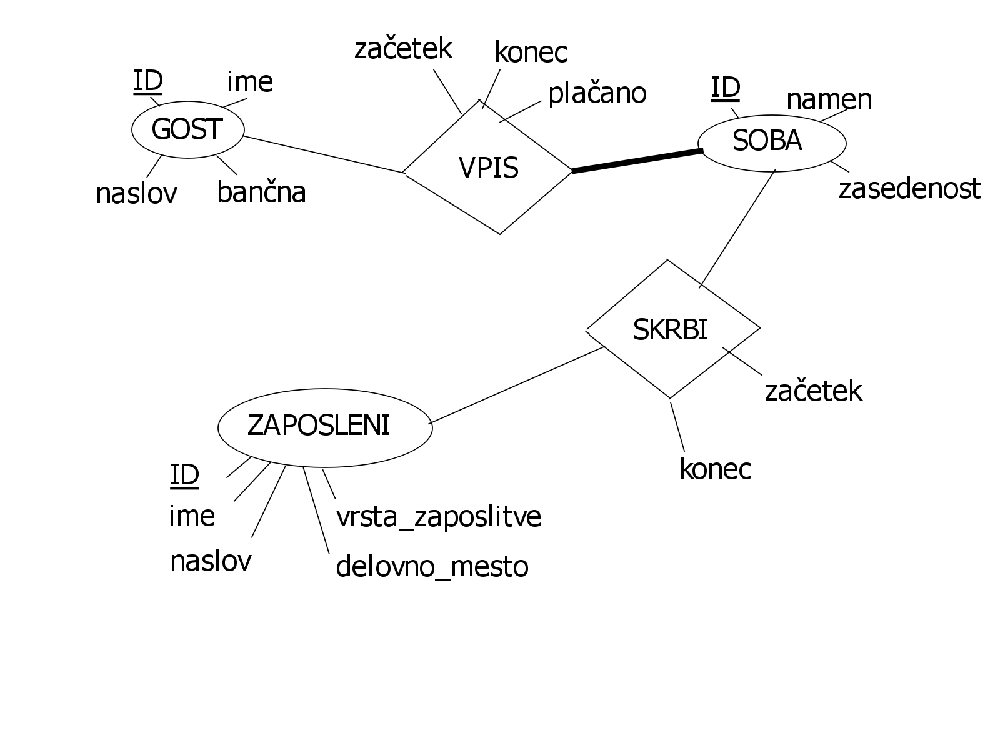

# PB_hotel

Avtor:
* Luka Markelj
    
Seminrska pri predmetu PB1

##OPIS
V bazi hranimo podatke o hotelu in sicer o zaposlenih,gostih in sobah. Končni izdelek bo spletna stran,kjer bodo lahko:
* uporabniki(gosti) rezervirali sobo
* recepcionisti jih vpisali v sobe in poračunali stroške
* uporabniki pogledali katere sobe so proste

##ER diagram
